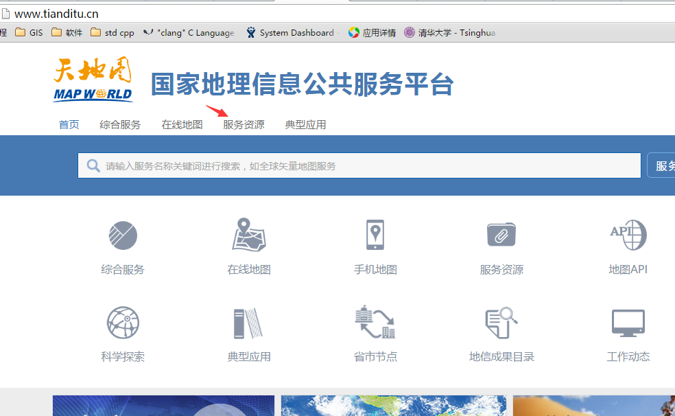
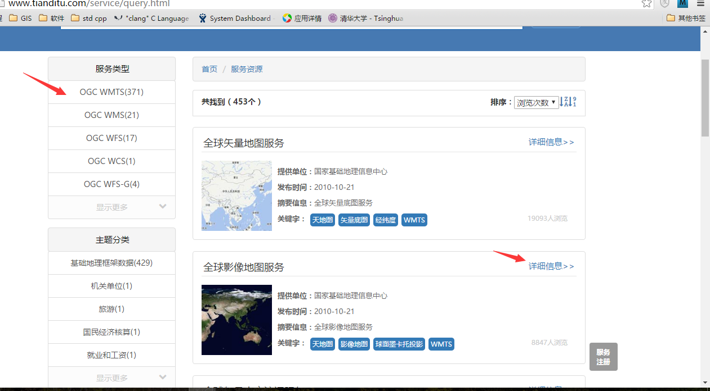
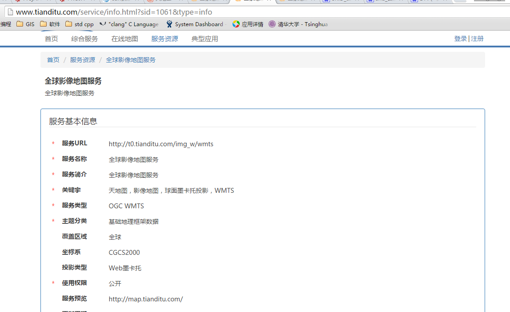
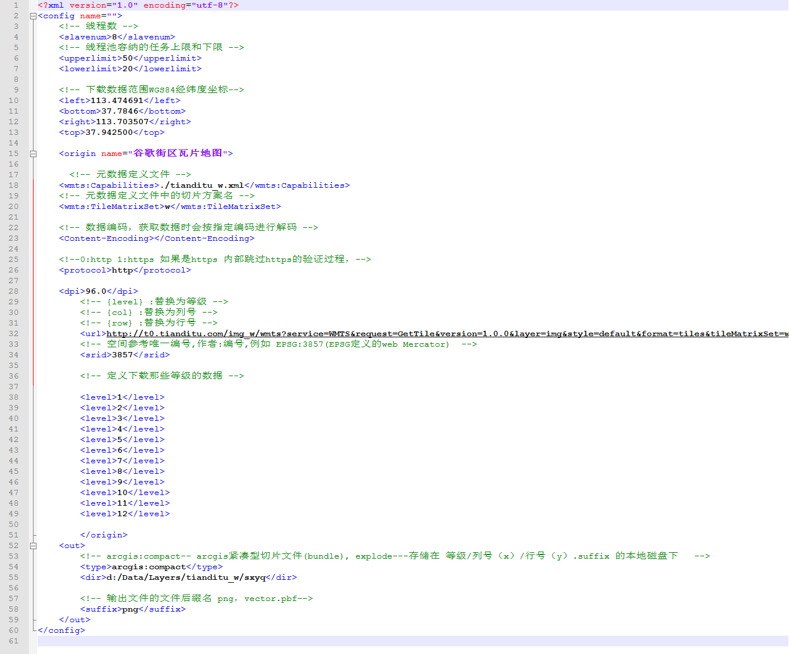
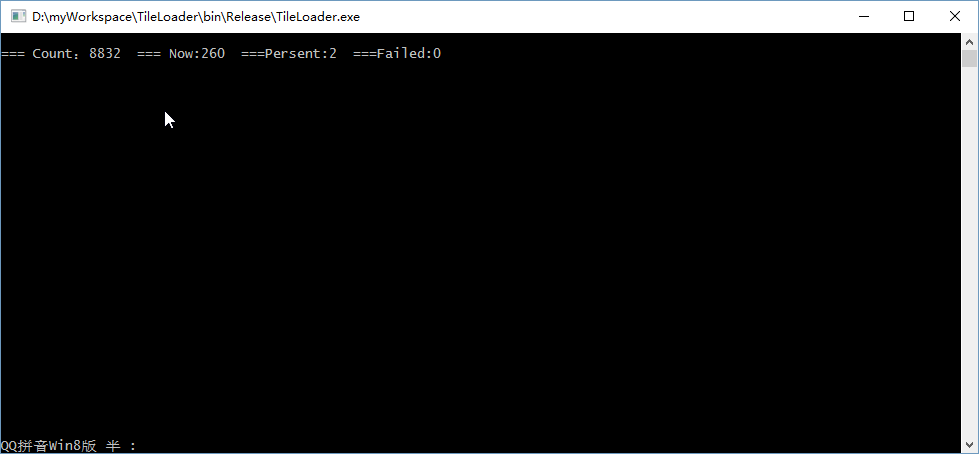

#地图瓦片下载器使用说明

##简介
该工具没有可视化，通过配置文件的方式控制下载的地图资源。同类的产品有水经注地图
下载器，太乐地图下载器等。该地图下载器使用OGC定义的WMTS的切片方案定义文件计算
地图瓦片的等级、行、列号，该下载器支持自定义已知切片方案的所有地图资源。

##配置文件
程序配置使用和程序同级目录下的一个名为config.xml的文件定义，定义的内容包括服务程序运行参数，下载地图资源
参数等。如下为配置文件配置参数说明。

服务程序运行参数：
* slavenum [int] 执行下载的最大线程数
* upperlimit [int] 内务队列上限，当达到上限时，添加任务的通道将被阻塞
* lowerlimit [int] 回复添加任务通道，队列任务下限

资源参数配置：
* left [double] 下载瓦片的地理范围WGS84的经纬度坐标，x轴最小值
* bottom [double] 下载瓦片的地理范围WGS84的经纬度坐标，y轴最小值
* right [double] 下载瓦片的地理范围WGS84的经纬度坐标，x轴最大值
* top [double] 下载瓦片的地理范围WGS84的经纬度坐标，y轴最大值
* origin 源定义
	* wmts:Capabilities [string] 本地文件位置，WMTS服务的元数据定义，如果数据源不是WMTS服务也需要该文件，该文件中定义数据源的切片方案
	* wmts::TileMatrixSet [string] 切片方案名称，在wmts:Capabilities指定的文件
	* Content-Encoding [string] 网页文件编码，通常有gzip,deflate，如果网页的内容是没有编码过的此参数内容为空
	* protocol [string] 网络传输协议，支持http和https两种，其中https会直接跳过验证
	* dpi [double] 原始地图切片的 [DPI](http://baike.baidu.com/link?url=J_S8C-8vykogMluybrwIP1VtrZobQ2OFudM0LJ_mqQh1GQCVfyO8mPO0-hZVwj1zabc63OcqTpQEwdBvZrYVWY7GFlcbMcFiPGCoIaaTYcG) , 通常情况下国际电工协会定义的标准DPI为90.071，而国标为96，例如谷歌地图使用的是90.071，而天地图使用的是96
	* url [string] 下载地图资源的模版，其中
		* {level} 替换成切片等级参数
		* {row}   替换成行号的参数
		* {col}   替换成列号的参数
	* srid [int]  空间参考标识符，连接的投影定义文件的投影定义中
	* level [int] 可以有多个定义，需要下载的瓦片等级
* out
	* type   输出文件形式,arcgis:compact瓦片资源下载为ArcGIS紧凑性切片文件（bundle），explode下载为单个瓦片文件存放形式为 等级/列号（X轴）/行号（Y）.suffix的本地目录下
	* dir    数据输出目录
	* suffix 当输出格式为explode时，瓦片的后缀名

##投影
投影配置使用和程序同级目录下的名为spatial_ref_sys.json的文件定义，定义程序使用到的地图坐标系。一般情况下不需要修改该文件，因为大多数的地图切片使用的web摩卡托投影和WGS84
经纬直投两个坐标系都已经在该文件中定义，如果有特殊的需求请参考[proj4](http://trac.osgeo.org/proj/)的相关文档说明。如下是一个坐标系的定义参数：
* srid [必须] 自定义的空间参考标识符
* auth_name [必须] 原始坐标系定义组织名称
* auth_srid [必须] 原始坐标系空间参考标识符
* ref_sys_name [必须] 坐标参考系统名
* proj4text [必须] 坐标系的proj4定义字符串
* label [可选] 附件说明

可以在该文件中新增、删除、修改坐标系定义。

##Demo

###下载山西阳泉webMercator卫星影响地图瓦片数据

1. 获取资源连接

主页

资源导航

webMercator影响切片详细信息

根据WMTS标准定义获取元数据:

http://t0.tianditu.com/img_w/wmts?service=WMTS&request=GetCapabilities

使用浏览器将元数据定义另存为tianditu_w.xml文件，并将其保存在程序统计目录下。

根据WMTS标准定义获取获取瓦片的连接：

http://t0.tianditu.com/img_w/wmts?service=WMTS&request=GetTile&version=1.0.0&layer=img&style=default&format=tiles&tileMatrixSet=w&TileMatrix=14&TileRow=6331&TileCol=13362

从瓦片获取连接得到获取连接模版：

http://t0.tianditu.com/img_w/wmts?service=WMTS&request=GetTile&version=1.0.0&layer=img&style=default&format=tiles&tileMatrixSet=w&TileMatrix={level}&TileRow={row}&TileCol={col}

也可以通过fidder截取报文的方式得到获取瓦片的连接，然后通过分析、修改得到获取连接模版。对于不是WMTS服务的切片地图服务，只要其切片方案是已知的（例如google地图）就可以通过自定义
WMTS元数据文件和fidder截取的下载瓦片的模版下载地图瓦片。google地图、百度地图、bing地图等都不是wmts服务但是其理论依据都是google切片地图技术，关于google切片地图的详细信息可以
在网上很容易的找到，不在此文件中讨论。

2. 修改配置文件
修改后的配置文件内容如下：

3. 启动下载程序下载瓦片

* count 需要下载的瓦片总数
* Now 当前下载了多少张瓦片
* Persent 下载完成百分比
* Failed 下载瓦片失败数

另外，在程序统计目录下的log文件加内有下载瓦片过程的日志信息。

